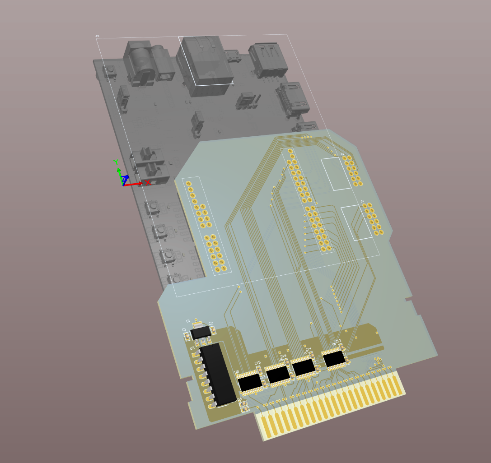

# SNESDRONE-PCB (Direct_IO Branch)

This branch is focused on the development of the FPGA interface for the SNESDRONE cartridge. The goal is to allow direct control of the SNES data and address buses using a Digilent Arty Z7 board mounted on the cartridge.

## Features (Work in Progress)
- **FPGA Interface**: The Digilent Arty Z7 will be used to directly interact with the SNES system via the cartridge.
- **Level Shifters**: Level shifters between the SNES and FPGA are integrated into the schematic.
- **Power Supply**: Power supply for the Arty Z7 is under consideration and still needs to be designed.

## Status
- The PCB layout has been completed, and the board has been ordered.
- The next steps include testing the PCB and developing an FPGA design for the Zynq 7000 on the Digilent Arty Z7 20 Board.
- The FPGA design will simulate a ROM memory, allowing the execution of small programs on the SNES.

## Branches
- **Master Branch**: Contains the first release version of the PCB, which is fully functional without the FPGA interface.
- **Direct_IO Branch**: Contains the ongoing development of the FPGA interface.

For more details about the project and updates, visit the [Hackaday page](https://hackaday.io/project/162633-snes-drone).

## Installation
Not yet available. Check back as development progresses.

## License
This project is licensed under the MIT License - see the [LICENSE](LICENSE) file for details.
